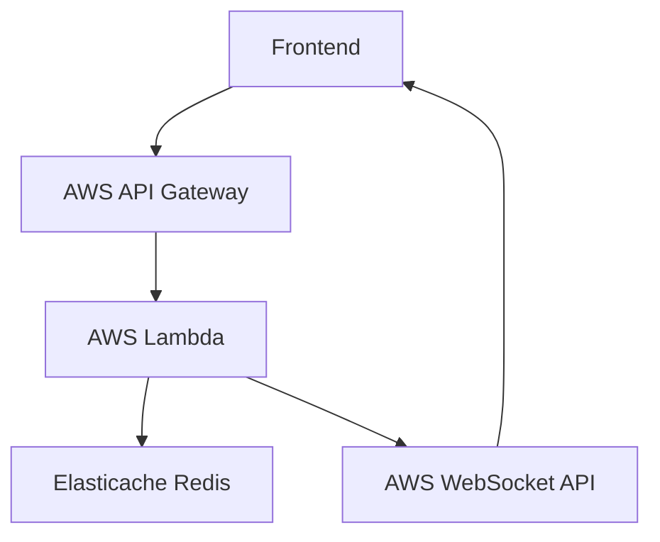
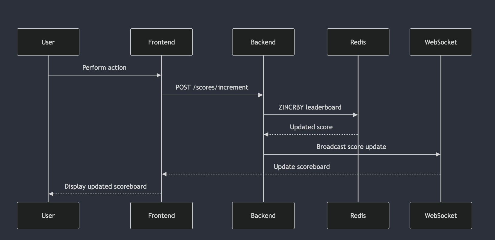

# Module Specification: Scoreboard System

## Overview

This module manages a **real-time scoreboard system** for a web application using Redis Sorted Set. It allows users to view the top scores, perform actions to increment their scores, and ensures secure handling of these updates. The system also supports real-time updates to ensure all users see the latest scores.

## Features

1. **Display Top 10 Scores**:
   - The scoreboard displays the top 10 users based on their scores, ordered from highest to lowest.
   - The data is fetched from Redis Sorted Set and updated in real-time.

2. **Real-time Updates**:
   - Users see live updates on the scoreboard when any score changes, without needing to refresh the page.
   - Real-time communication is managed via WebSocket.

3. **Score Increment**:
   - Users can perform certain actions (validated by the backend) to increment their scores.
   - The backend updates the score securely in Redis.

4. **Secure Updates**:
   - Only authenticated and authorized users can update their scores.
   - The system prevents malicious activities such as unauthorized score increments.

---

## Architecture Flow

The architecture consists of the following components:

1. **Frontend**:
   - Sends API requests for score updates and subscribes to WebSocket for real-time updates.
   - Displays the top 10 scores on the scoreboard.

2. **Backend API**:
   - Handles requests for retrieving top scores, validating actions, and updating scores.
   - Interacts directly with Redis for score management.
   - Publishes real-time updates to WebSocket clients.

3. **Redis**:
   - Stores the scoreboard data using the Sorted Set data type.
   - Supports efficient operations for top N queries, score updates, and rank retrieval.

---

## API Endpoints

### 1. **Get Top Scores** (GET `/scores/top`)
- **Description**: Retrieves the top 10 scores for display on the scoreboard.
- **Request**: No parameters required.
- **Response**:
  ```json
  [
    { "user": "Alice", "score": 1200 },
    { "user": "Bob", "score": 1150 },
    { "user": "Charlie", "score": 1100 }
  ]
  ```

### 2. **Increment Score** (POST `/scores/increment`)
- **Description**: Increments the score of a user based on a completed action.
- **Request Body**:
  ```json
  {
    "userId": "12345",
    "incrementBy": 10
  }
  ```
- **Validation**:
  - Verify the user is authenticated and authorized.
  - Validate that the increment amount is within allowed limits.

- **Response**:
  ```json
  { "status": "success", "newScore": 1210 }
  ```

### 3. **Realtime Updates** (WebSocket `/scores/updates`)
- **Description**: Sends live updates to all connected clients when a score changes.
- **Event Format**:
  ```json
  {
    "type": "scoreUpdate",
    "user": "Alice",
    "newScore": 1250
  }
  ```

---

## Redis Sorted Set Integration

### Redis Commands Used
1. **Add or Update Score**:
   ```bash
   ZADD leaderboard 1200 "Alice"
   ```

2. **Increment Score**:
   ```bash
   ZINCRBY leaderboard 10 "Alice"
   ```

3. **Get Top 10 Scores**:
   ```bash
   ZREVRANGE leaderboard 0 9 WITHSCORES
   ```

4. **Get Rank of a User**:
   ```bash
   ZREVRANK leaderboard "Alice"
   ```

5. **Remove a User**:
   ```bash
   ZREM leaderboard "Alice"
   ```

---

## Example AWS Deployment

This section describes how the scoreboard system can be deployed using AWS.

### AWS Services Used
1. **API Gateway**: Manage API endpoints for score retrieval and updates.
2. **Lambda**: Handle business logic (e.g., validating actions, updating scores).
3. **Elasticache for Redis**: Store the leaderboard data in a high-performance Redis instance.
4. **AWS WebSocket API**: Push real-time updates to the frontend.
5. **CloudWatch**: Monitor logs and performance.

### Architecture


### Steps to Deploy
1. **Set up an Elasticache for Redis**:
   - Create a Redis cluster using Elasticache.
   - Configure security groups to allow Lambda access.

2. **Create a Lambda Function**:
   - Write a Lambda function to handle API requests (e.g., increment score, get top scores).
   - Use the AWS SDK to connect to the Elasticache Redis instance.

3. **Configure API Gateway**:
   - Create REST APIs for `/scores/top` and `/scores/increment`.
   - Set up WebSocket API for real-time updates.

4. **Enable Logging**:
   - Use CloudWatch to monitor API Gateway and Lambda logs.

5. **Deploy the Frontend**:
   - Connect the frontend to API Gateway endpoints.

---

## Suggested Improvements

1. **Caching with Redis**:
   - Use Redis as the primary source for leaderboard data to improve performance.
   - Sync Redis with PostgreSQL periodically for long-term storage.

2. **Rate Limiting**:
   - Prevent abuse of the increment API using Redis counters.

3. **Pub/Sub for Real-time Updates**:
   - Use Redis Pub/Sub to broadcast leaderboard changes to WebSocket clients.

---

## Execution Flow Diagram
The following diagram illustrates the flow of execution in the scoreboard system:


